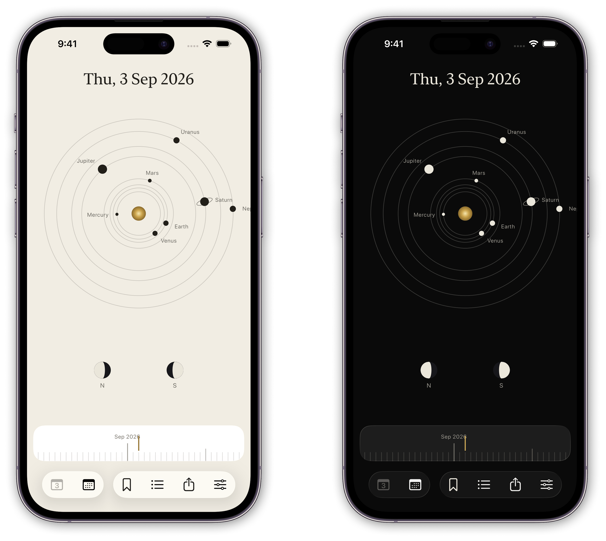

<p align="center">
  <picture>
    <source media="(prefers-color-scheme: dark)" srcset="Assets/Orbit%20and%20planet%20tint.png">
    
  </picture>
</p>

<h1 align="center">Orrery</h1>
<p align="center">A calm, on-device orrery for exploring where the planets and Moon stood on any day.</p>

---

<p align="center">
  
</p>

## About

Orrery draws the Sun, the eight planets, and the Moon's phase for any date you choose — past, present, or centuries into the future — entirely on your device. Scrub a timeline, jump to a date, and watch the solar system rearrange itself in real time.

All positions are computed locally with a vendored copy of [Astronomy Engine](https://github.com/cosinekitty/astronomy), so there's no network call, no server, and no tracking involved in showing you the sky.

## Features

- **Live orrery chart** — the Sun and 8 planets plotted by true orbital distance and ecliptic longitude, redrawn as you move through time.
- **Moon phase discs** — Northern and Southern hemisphere views with illumination percentage.
- **Scrub timeline** — drag, scroll, or use the trackpad/scroll wheel to glide through days, with month/year tick marks and a graphical date picker for jumping straight to a date.
- **Save & share** — bookmark interesting dates and share them as a polaroid-style card.
- **Customizable display** — toggle orbit rings, planet labels, and a compact Moon view; switch between system, light, and dark appearance.
- **Adjustable date range** — cache anywhere from ±5 to ±100 years of positions, computed once and stored locally.
- **Universal SwiftUI app** — one codebase adapting across iPhone, iPad, Mac, and Apple Vision Pro.

## Built with

- **SwiftUI** for the interface, with layouts that adapt between compact and large screens.
- **SwiftData** for persisting cached planetary data and saved dates.
- **[Astronomy Engine](https://github.com/cosinekitty/astronomy)** (vendored, MIT licensed) for on-device astronomical calculations — see [`NOTICES.md`](NOTICES.md) for details.

## Requirements

- Xcode 26 or later
- iOS / iPadOS 18.6+, macOS 14.6+, or visionOS 1.3+

## Getting started

```bash
git clone https://github.com/rishi-singh26/OrreryCalendar-SwiftUI.git
cd OrreryCalendar-SwiftUI
open Orrery.xcodeproj
```

Select the `Orrery` scheme and run it on your simulator or device of choice.

## Project structure

```
Orrery/
├── App/          # App entry point
├── Astronomy/    # Geometry and shape math for the chart
├── Data/         # SwiftData models, caching, and the Astronomy Engine bridge
├── Shared/       # Cross-platform utilities and small reusable views
├── Theme/        # Colors, appearance, and app storage keys
└── Views/        # Screens and UI components
AstronomyEngine/  # Vendored Astronomy Engine (Swift package wrapping the C library)
```

## Acknowledgments

Planetary and lunar positions are computed using [Astronomy Engine](https://github.com/cosinekitty/astronomy) by Don Cross. See [`NOTICES.md`](NOTICES.md) for the full third-party notice.

## License

Orrery is released under the [MIT License](LICENSE). Third-party components retain their own licenses — see [`NOTICES.md`](NOTICES.md).
